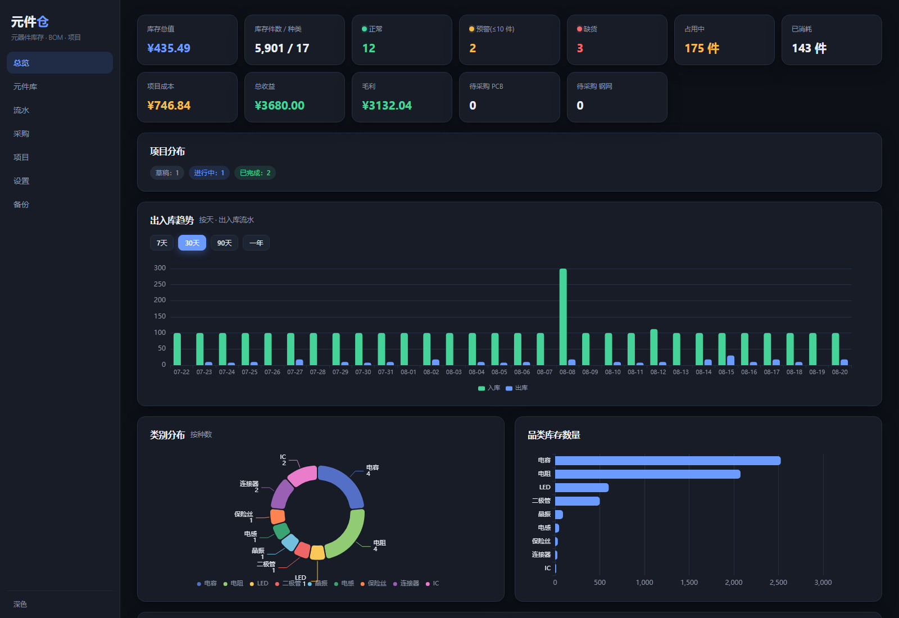
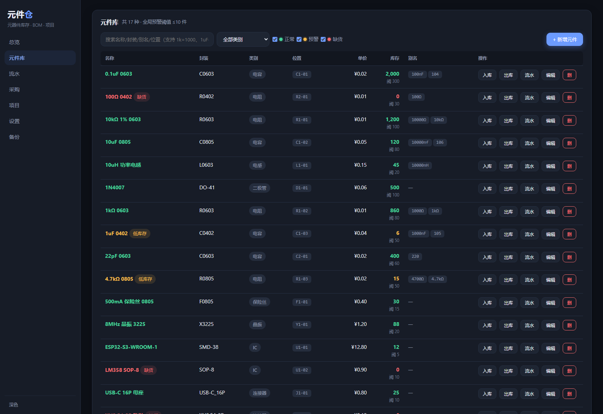
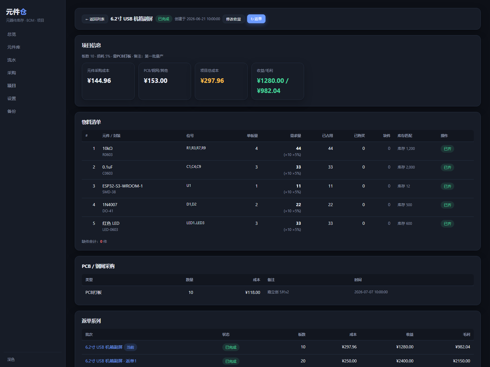
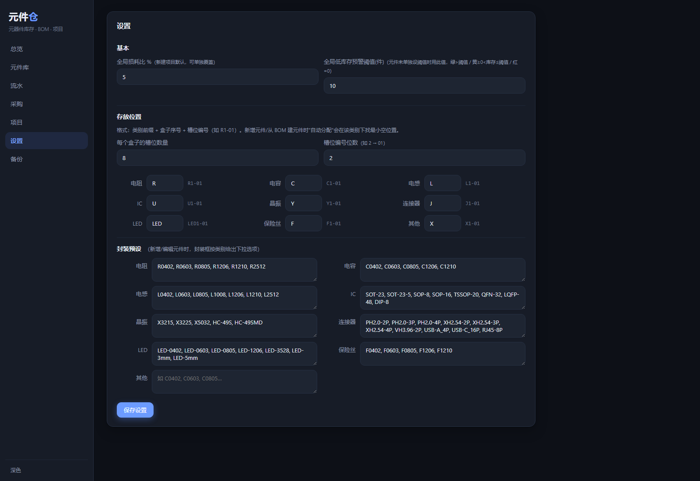
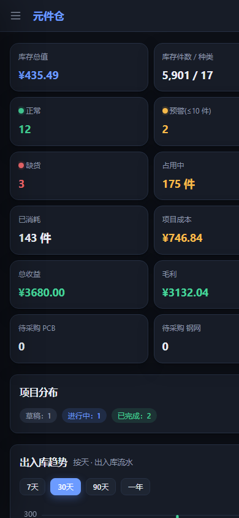
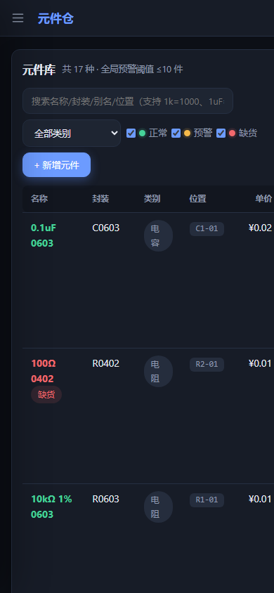

# 元件仓 · 元器件库存 & 立创 BOM 对比工具

一个局域网共享的 Web 工具：维护元件库存，上传立创 EDA 导出的 BOM，自动对比计算**剩余量 / 缺件**，
支持同类型别名匹配（`0.1uF = 100nF = 104`），可配置损耗比、记录项目状态（草稿/进行中/已完成/已关闭）、
采购入库、成本与收益统计、一键备份恢复。

## 界面预览

> 截图使用演示数据，仅供参考。

**桌面端**

| 总览 | 元件库 |
| --- | --- |
|  |  |

| 项目详情 | 设置 |
| --- | --- |
|  |  |

**移动端**

| 总览 | 元件库 |
| --- | --- |
|  |  |

## 功能

- **元件库**：名称+封装（忽略大小写）唯一；可维护同类型别名；手动入库/出库；单价；类别与缺货筛选
  - **单位等价换算**：搜索支持 `1k=1000Ω`、`1uF=1000nF` 自动等价匹配；新增/编辑元件时按元件类型自动生成等价别名（电容：`1uF→1000nF,105`；电阻：`1k→1000Ω,1kΩ`（不生成 EIA 码避免与电容混淆）；电感：`47uH→47000nH`）
  - **存放位置**：`前缀+盒子-槽位`（如 `R1-01`），新增时点「自动分配」取该类别最小空位；前缀、每个盒子的槽位数量、槽位编号位数均可在设置里配置
  - **三档库存预警**：每元件可设独立预警阈值（留空回退全局阈值），绿=正常、黄=预警(低库存)、红=缺货，可三档筛选
  - **封装预设**：设置页按类别维护封装列表（默认内置立创风格预设，如电阻 R0402/R0603/R0805…、电容 C0402/C0603…、IC SOT-23/SOP-8… 等），新增/编辑时封装框出现该类别预设下拉，仍可自由输入
  - **从 BOM 建元件自动分配位置**：BOM 中一键新建的元件自动分配存放位置（按类别前缀取最小空位）
- **BOM 导入**：解析立创导出的 `.xlsx` / `.csv`（含 Name / Designator / Footprint / Quantity 列）；上传后可逐条删除 BOM 行（草稿阶段）
- **自动匹配**：名称+封装 → 用户别名 → 值归一化（`10kΩ=10K`、`0.1uF=100nF=104`），匹配不上的可手动改名绑定，或一键按 BOM 建新元件；元件删除时会自动解除项目绑定
- **元件自动分类**：从 BOM 建元件时按位号前缀自动分类（R→电阻、C→电容、L→电感、U→IC、D→二极管、LED→LED、Q→晶体管、J/CN→连接器、Y/X→晶振、SW→开关、F→保险丝），识别不到再按名称单位归类（Ω→电阻/F→电容/H→电感），可在编辑里修改
- **项目状态**：草稿 →（确认，占用库存）→ 进行中 → **已完成**（需缺件全补齐；可填收益、可返单）/ **关闭**（仅进行中可用，退回元件并直接删除项目）
- **返单**：已完成项目可一键克隆出新的独立草稿项目（填新的板数，可勾选是否需要 PCB/钢网），自动复用元件列表/开关/损耗；按系列在项目列表折叠展示，可看系列各批次成本/收益与毛利趋势
- **项目选项**：PCB 打板、钢网采购（开关在项目上，**成本改为采购时填写并计入项目**）、其他费用
- **损耗比**：全局默认，每个项目可覆盖；需求 = BOM数量 × 板数 × (1+损耗%) 向上取整
- **采购自动补缺**：购买时自动补齐项目缺件（补入部分计入占用/消耗），超出缺件的余量转入库存（缺6买10 → 6 补缺、4 入库存）
- **采购页**：统一管理 待采购元件缺件、待采购 PCB/钢网（显示对应项目名并填写实际成本）、已采购记录
- **出入库流水**：入库/出库/项目占用/采购/退回全记录，可按元件与类型筛选
- **总览**：库存总值、占用中、累计消耗、成本、收益、毛利、待采购 PCB/钢网计数；ECharts 图表（出入库趋势可按 7/30/90天/一年切换、类别分布环形图、品类库存柱状图、成本与盈利曲线）、三档库存状态统计
- **备份**：一键导出/导入 JSON（导入前自动留底）

## 运行方式

### 方式一：Docker（推荐）

需要已安装 Docker / Docker Compose。

```bash
docker compose up -d --build
```

访问 `http://<本机IP>:8080`，同局域网设备可通过 `http://<本机IP>:8080` 访问。
数据保存在宿主机 `./data/` 目录，整个复制即可备份。

### 方式二：本机 Python 直接运行（无需 Docker）

```bash
pip install -r requirements.txt
python -m uvicorn app.main:app --host 0.0.0.0 --port 8080
# 或 Windows 双击后运行：
set DATA_DIR=data
python -m uvicorn app.main:app --host 0.0.0.0 --port 8080
```

## 目录

```
app/            FastAPI 后端（db / matching / bom 解析 / main 路由）
static/         前端（原生 HTML/CSS/JS，中文，无构建）
data/           运行时生成的 SQLite 数据库（可整体备份）
```

## 开源协议

[MIT](./LICENSE) © 2026 Everaine
